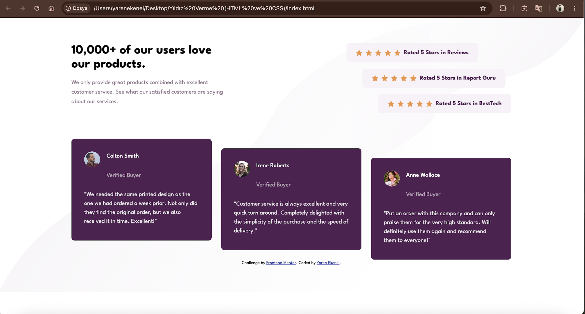

# Frontend Mentor - Social proof section solution

This is a solution to the [Social proof section challenge on Frontend Mentor](https://www.frontendmentor.io/challenges/social-proof-section-6e0qTv_bA). Frontend Mentor challenges help you improve your coding skills by building realistic projects.

## Table of contents

- [Overview](#overview)
  - [The challenge](#the-challenge)
  - [Screenshot](#screenshot)
  - [Links](#links)
- [My process](#my-process)
  - [Built with](#built-with)
  - [What I learned](#what-i-learned)
  - [Continued development](#continued-development)
- [Author](#author)

## Overview

### The challenge

Users should be able to:

- View the optimal layout for the section depending on their device's screen size

### Screenshot

### Links

- Solution URL: [GitHub Repository](https://github.com/yarenekenel/Social-Proof-Section)
- Live Site URL: [Live Site](https://yarenekenel.github.io/Social-Proof-Section/)

## My process

### Built with

- Semantic HTML5 markup
- CSS custom properties
- Flexbox
- CSS Grid
- Responsive design

### What I learned

While working on this project, I practiced building a responsive layout with pure CSS. I learned how to create the staggered positioning of the rating boxes and testimonial cards, and how to adapt the layout for both mobile and desktop screens using media queries.

### Continued development

In future projects, I want to improve my skills in writing accessible and semantic HTML.

## Author

- GitHub - [@yarenekenel](https://github.com/yarenekenel)
